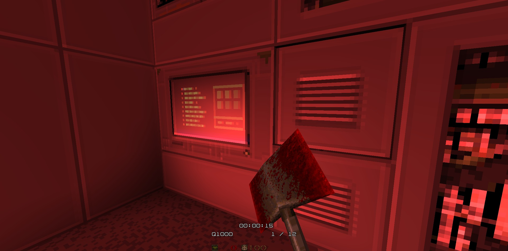

# QSMAT (QuakeShack Material) Format

The `.qsmat.json` file format is used to define PBR (Physically Based Rendering) materials for Quake BSP maps in the QuakeShack engine. It allows replacing or augmenting standard Quake textures with high-resolution diffuse, normal, specular, and luminance maps.

## Filename Convention

The material definition file must have the same base name as the BSP file it corresponds to, with the extension `.qsmat.json`.

**Example:**
If your map file is: `maps/example.bsp`
Your material file should be: `maps/example.qsmat.json`

## Format Structure

The file is a standard JSON object with the following top-level properties:

| Property | Type | Description |
|----------|------|-------------|
| `version` | `number` | The version of the format. Currently, this must be set to `1`. |
| `materials` | `object` | A dictionary where keys are the texture names used in the BSP file, and values are material definitions. |

### Material Definition

Each entry in the `materials` object defines the properties for a specific texture. The key must match the texture name in the BSP file (case-sensitive, typically uppercase).

| Property | Type | Description |
|----------|------|-------------|
| `diffuse` | `string` | Path to the diffuse (albedo) texture. If omitted, the original texture from the BSP/WAD is used. |
| `normal` | `string` | Path to the normal map texture. |
| `specular` | `string` | Path to the specular map texture. |
| `luminance` | `string` | Path to the luminance (emissive) texture, layered on top of the lightmap. |
| `flags` | `string[]` | An array of material flags. |

### Material Flags

The `flags` array can contain the following strings:

| Flag | Description |
|------|-------------|
| `MF_TRANSPARENT` | Use alpha blending for this material. Useful for glass, grating, etc. Note that textures starting with `{` are automatically marked as transparent by the engine. |
| `MF_SKY` | Marks the surface as a sky surface. |
| `MF_TURBULENT` | Applies turbulent deformation (like water/slime/lava). Textures starting with `*` or `!` are automatically marked as turbulent. |

## Example

```json
{
  "version": 1,
  "materials": {
    "BRICK1": {
      "diffuse": "textures/walls/brick1_d.png",
      "normal": "textures/walls/brick1_n.png",
      "specular": "textures/walls/brick1_s.png"
    },
    "LIGHT01": {
      "diffuse": "textures/lights/light01_d.png",
      "luminance": "textures/lights/light01_l.png"
    },
    "GLASS": {
      "diffuse": "textures/windows/glass_d.png",
      "flags": ["MF_TRANSPARENT"]
    }
  }
}
```

## Notes

1. Texture paths are relative to the game directory (e.g., `id1/`).
2. The engine uses `GLTexture.FromImageFile` to load these textures, so standard image formats supported by the browser (PNG, JPG, etc.) are acceptable. Make sure the dimensions are each a power of two, e.g. 512x512.
3. If a `diffuse` map is not provided in the `.qsmat.json`, the engine will use the original diffuse texture data from the BSP file, allowing you to add only normal or specular maps to existing textures.

## In-game example

See [video showing support of PBR materials](./img/pbr-support.mp4).




