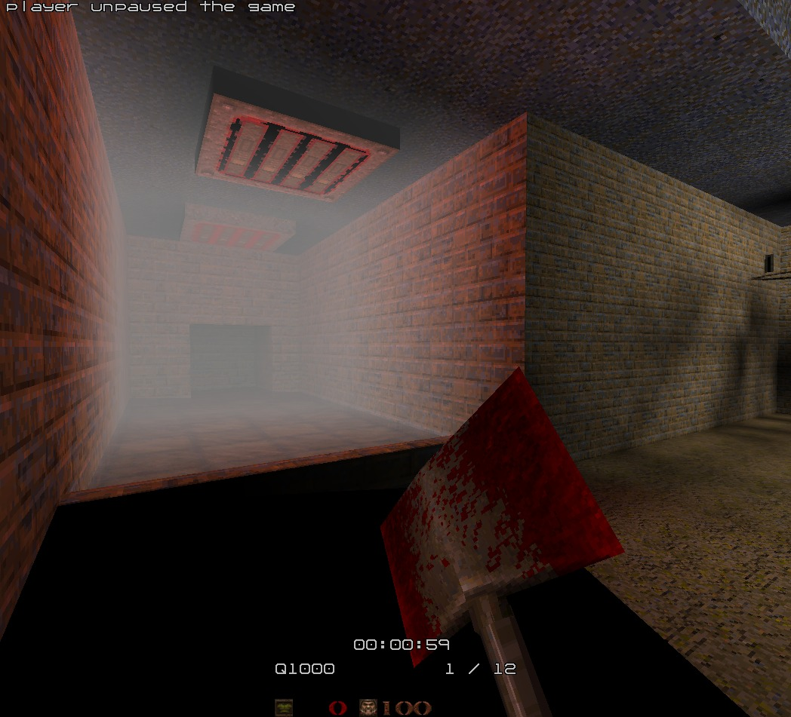
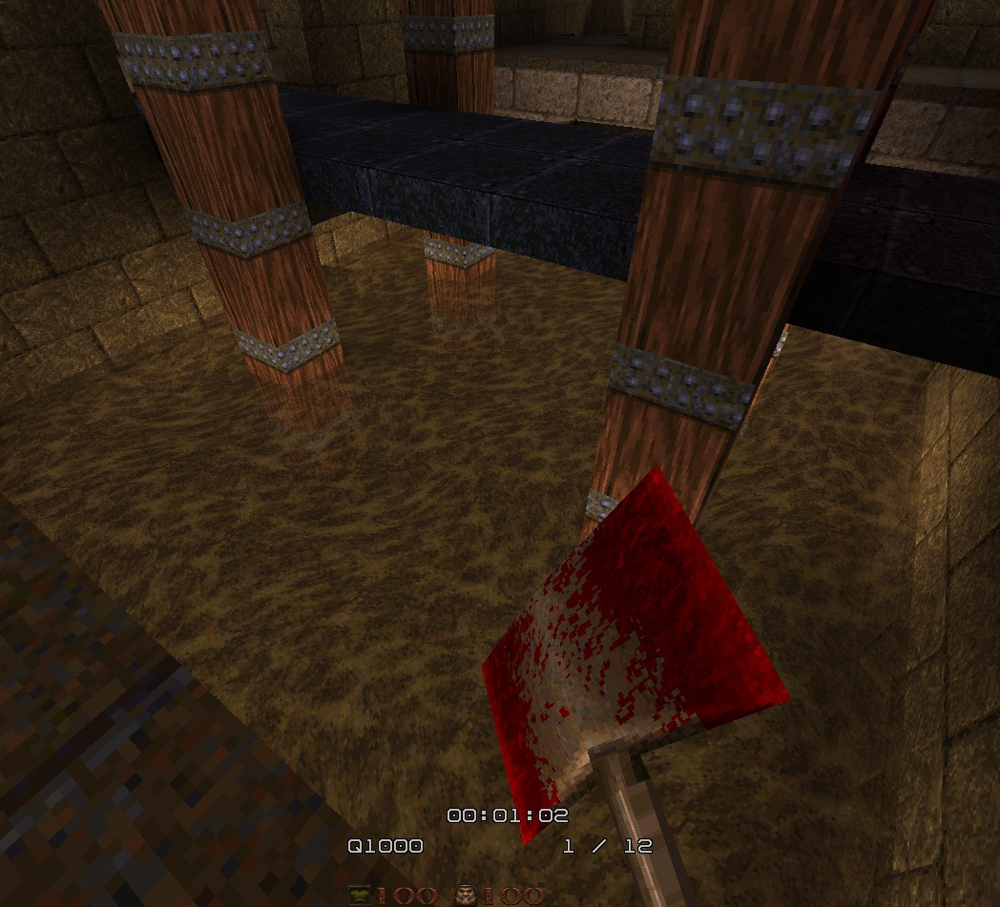
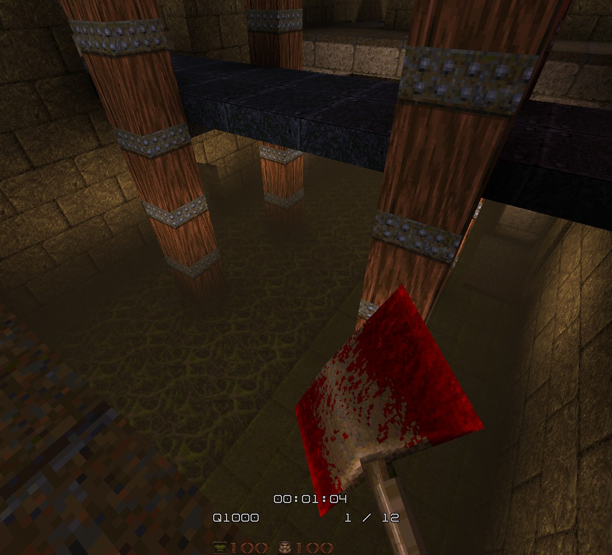

# Volumetric Fog

Volumetric fog allows you to create atmospheric fog volumes in your maps that players can see and move through. Think of misty swamps, smoky rooms, or mysterious alien atmospheres.

## Creating Fog Volumes

There are two ways to add fog to your maps:

### 1. Manual Fog Volumes (func_fog)

Create a brush-based entity with the classname `func_fog`. This gives you precise control over where fog appears.

**Properties:**

- `fog_color` - RGB color as three numbers (e.g., `128 128 128` for gray fog)
- `fog_density` - How thick the fog is (e.g., `0.01` for light fog, `0.1` for dense fog)
- `fog_max_opacity` - Maximum fog opacity from 0 to 1 (e.g., `0.8` means fog can block up to 80% of visibility)

**Example usage:**

```
{
"classname" "func_fog"
"fog_color" "100 150 200"
"fog_density" "0.02"
"fog_max_opacity" "0.7"
}
```

This creates a blue-tinted fog with medium density.

**Example screenshot:**



### 2. Automatic Water/Liquid Fog

QuakeShack automatically generates fog for water, slime, and lava volumes in your map. No extra work needed! The engine:

- Detects liquid-filled areas from your BSP
- Analyzes the texture colors to match the fog color
- Creates appropriately colored fog (blue for water, green for slime, orange-red for lava)

**NOTE**: Since this works not well enough on old maps, this feature is opt-in by setting `_qs_autogen_fog` to 1 on `worldspawn`.

## Tips for Mappers

**Color Selection:**

- Use darker colors for mysterious/spooky atmospheres
- Light blues and whites work great for mist
- Green/yellow for toxic areas
- Orange/red for hot environments

**Density:**

- Start with `0.01` and adjust to taste
- Values around `0.05-0.1` create thick, oppressive fog
- Lower values (`0.005`) create subtle atmosphere

**Max Opacity:**

- `0.5-0.7` allows players to still see through the fog
- `0.9+` creates nearly opaque fog (use sparingly!)
- Lower values (`0.3-0.5`) for subtle effect layers

**Good to know:**

- Light sources will affect the volumes:
  - Color values are sampled from the lightgrid, make sure to export it
  - Dynamic lights might blast the fog
- Use larger brushes to build a fog area:
  - Smaller brushes will lead to chunked/overlapping fog areas

## Performance Notes

Fog volumes are lightweight and shouldn't impact performance significantly. Feel free to use multiple fog volumes in the same map for different areas with different atmospheres.

## Integration with Other Features

- Fog volumes respect BSP visibility - players only see fog in volumes they can reach
- Works with colored lighting for cohesive atmosphere
- Multiple fog volumes can overlap (newer volumes override in overlapping regions)

## Example

This is the effect in question when combined with 50% transparency on the turbulent faces.



When rendering of turbulents is disabled, it’s clear that the volumentric fog is rendered inside.


